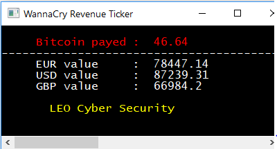

# About the WannaCry Bitcoin Tracker
The WannaCry Bitcoin tracker was created to help analysts monitor the total amount of Bitcoin, and their  traditional currency values, related to the Bitcoin wallets associated with the WannaCry ransomware.

## Installation

Use Git or checkout with SVN using the web URL to install the tool:

```
$ git clone https://github.com/Leo-CS/WannaCry-BC-Tracker.git
```

### Python Version

Note: The Python version was developed using Python 3.6.x and will not work with 2.7.x.

#### Additional Libraries

Several libraries are required for the tool to function properly. These libraries include:

* pycurl

## Usage

### Windows Version

Run the WannaCryBC.exe executable.



### Python Version

```
$ python3 btc_track.py

Bitcoin paid:  46.13
----------------------------------------
USD : 84271.49
ISK : 8539991.3
HKD : 655844.96
TWD : 2554610.14
CHF : 82464.3
EUR : 75778.43
DKK : 563884.36
CLP : 56680163.68
CAD : 114962.38
INR : 5465195.97
CNY : 580807.76
THB : 2905702.08
AUD : 113297.72
SGD : 117318.01
KRW : 95047710.02
JPY : 9335520.45
PLN : 319710.55
GBP : 64705.12
SEK : 739809.25
NZD : 121651.48
BRL : 264191.3
RUB : 4882943.1

```

## Authors and Contributors
* Brian Kellogg, <a href="https://twitter.com/the_flakes">@the_flakes</a>
* Andrew Hay, <a href="https://twitter.com/andrewsmhay">@andrewsmhay</a>

## Support

Please submit all issues, questions, and feature requests using GitHub's _Issues_ section.

## License

The MIT License (MIT)

Copyright (c) 2017 LEO Cyber Security.

Permission is hereby granted, free of charge, to any person obtaining a copy of this software and associated documentation files (the "Software"), to deal in the Software without restriction, including without limitation the rights to use, copy, modify, merge, publish, distribute, sublicense, and/or sell copies of the Software, and to permit persons to whom the Software is furnished to do so, subject to the following conditions:

The above copyright notice and this permission notice shall be included in all copies or substantial portions of the Software.

THE SOFTWARE IS PROVIDED "AS IS", WITHOUT WARRANTY OF ANY KIND, EXPRESS OR IMPLIED, INCLUDING BUT NOT LIMITED TO THE WARRANTIES OF MERCHANTABILITY, FITNESS FOR A PARTICULAR PURPOSE AND NONINFRINGEMENT. IN NO EVENT SHALL THE AUTHORS OR COPYRIGHT HOLDERS BE LIABLE FOR ANY CLAIM, DAMAGES OR OTHER LIABILITY, WHETHER IN AN ACTION OF CONTRACT, TORT OR OTHERWISE, ARISING FROM, OUT OF OR IN CONNECTION WITH THE SOFTWARE OR THE USE OR OTHER DEALINGS IN THE SOFTWARE.
